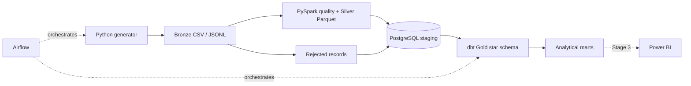
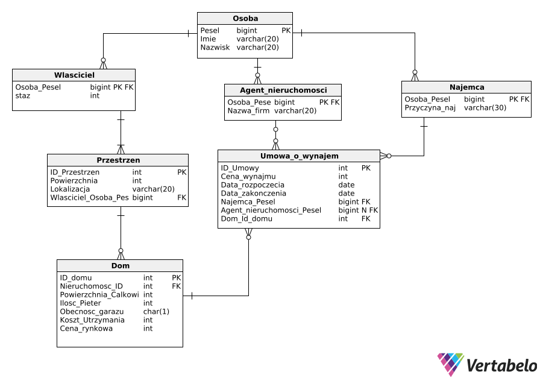

# Rental Analytics & Data Engineering Platform

A reproducible data platform that turns rental source records into quality-controlled Parquet datasets, incrementally loaded PostgreSQL staging tables, a tested dbt star schema, and business-facing analytical marts. It develops an existing third-semester database assignment into a focused portfolio project without removing its SQL Server or Oracle history.

## Project status

**Stages 1 and 2 are implemented.** The working flow is:



Stage 3—Power BI artifacts, measured index benchmarks, and final operational polish—remains a roadmap item and is not claimed here.

## Key capabilities

- Deterministic, extension-stable source generation with configurable dataset size, seed, nine realistic quality scenarios, and a controlled rent change.
- Explicit Bronze, Silver, staging, Gold, and mart responsibilities, with Parquet as the typed intermediate format.
- Record-level quarantine with reason codes, readable explanations, raw JSON, source ID, batch ID, and UTC timestamps.
- Fingerprint-driven incremental loading: insert new keys, update changed business values, and skip unchanged rows.
- Audited runs whose input, accepted, rejected, inserted, updated, and skipped counts reconcile.
- A dbt project with 22 models, one property-history snapshot, built-in schema tests, and custom business tests.
- An Airflow DAG matching the real seven-step workflow and an optional local Compose profile.
- pytest, Ruff, package build checks, PostgreSQL integration tests, dbt validation, DAG import tests, and GitHub Actions gates.

## Data model

The default seed `42` / size `12` profile contains 81 valid records: 5 locations, 4 owners, 12 tenants, 12 properties, 12 agreements, and 36 payments. Increasing the size to 13 appends seven records without changing the existing business rows.

dbt builds these Gold tables in `analytics`:

- dimensions: `dim_date`, `dim_location`, `dim_property`, `dim_owner`, `dim_tenant`;
- facts: `fact_rental_agreement`, `fact_payment`, `fact_occupancy`;
- marts: occupancy, monthly rental revenue, overdue payments, average rent per square metre, agreements expiring soon, and rental trends by location.

`analytics_snapshots.property_history` uses a dbt check snapshot to retain SCD Type 2 history for rent and selected property attributes. See the [data dictionary](docs/data-dictionary.md) and [lineage](docs/lineage.md).

## Quickstart with Docker

Requirements: Docker Engine/Desktop with Docker Compose. The images provide Python 3.12, Java 17, PySpark 3.5.9, dbt Core 1.11.14, dbt-postgres 1.11.0, and optionally Airflow 2.11.2.

```powershell
# Development-only defaults; change them outside local development
Copy-Item .env.example .env

# Validate the complete model and start a healthy PostgreSQL 16 instance
docker compose --profile pipeline --profile airflow config --quiet
docker compose up --detach --wait postgres

# Build and run source -> Bronze -> Silver -> incremental staging
docker compose --profile pipeline run --build --rm pipeline run --batch-id quickstart-001

# Build all dbt models, snapshot, and tests
docker compose --profile pipeline run --rm dbt

# Inspect the audited result
docker compose exec postgres psql -U rental -d rental_analytics -c "SELECT batch_id, input_count, accepted_count, rejected_count, inserted_count, updated_count, skipped_count, final_status FROM staging.pipeline_runs ORDER BY started_at DESC LIMIT 1;"
```

Repeat the pipeline with a different batch ID to prove unchanged records are skipped:

```powershell
docker compose --profile pipeline run --rm pipeline run --batch-id quickstart-002
```

Exercise an appended record, a changed rent, and all deterministic quality scenarios:

```powershell
docker compose --profile pipeline run --rm pipeline run --batch-id quickstart-new --dataset-size 13
docker compose --profile pipeline run --rm pipeline run --batch-id quickstart-changed --dataset-size 13 --rent-adjustment 250
docker compose --profile pipeline run --rm pipeline run --batch-id quickstart-invalid --dataset-size 13 --rent-adjustment 250 --quality-issues 9
docker compose --profile pipeline run --rm dbt
```

Stop services while preserving the named PostgreSQL volume with `docker compose down`. Use `docker compose down --volumes` only for an intentional clean reset. Both versioned scripts in `warehouse/migrations/` are applied automatically when a new volume is initialized.

## Airflow

The optional DAG is `generate -> ingest -> validate -> transform -> load -> dbt_build -> publish_run_summary`.

```powershell
docker compose --profile airflow up --build --detach airflow
docker compose --profile airflow ps
```

Open `http://localhost:8080`, sign in with the development credentials configured in `.env`, and trigger `rental_analytics_pipeline`. The load task retries transient database failures twice; deterministic file tasks do not retry. Full behavior is documented in [Airflow orchestration](docs/orchestration.md).

## Local Python workflow

Use Python 3.12 and Java 17. PostgreSQL may still run in Docker.

```powershell
py -3.12 -m venv .venv
.venv\Scripts\python -m pip install --upgrade pip
.venv\Scripts\python -m pip install --editable ".[dev,warehouse,orchestration]"
docker compose up --detach --wait postgres

.venv\Scripts\rental-platform run --batch-id local-001
.venv\Scripts\dbt build --project-dir warehouse/dbt --profiles-dir warehouse/dbt
.venv\Scripts\ruff check .
.venv\Scripts\ruff format --check .
$env:AIRFLOW__CORE__LOAD_EXAMPLES="false"
.venv\Scripts\pytest
```

Individual CLI steps are also executable: `generate`, `ingest`, `validate`, `transform`, `load`, and `summary`. Run `rental-platform --help` or a subcommand with `--help` for options. All application settings use the `RENTAL_` prefix and are listed in `.env.example`; credentials are never logged.

## Quality, incremental behavior, and failures

Quality rules enforce required values, types, bounded sizes/rents, valid date ranges, supported categorical values, uniqueness, and relationships. Harmless location whitespace/casing is normalized; invalid rows are written to `data/rejected/<batch-id>/rejected_records.jsonl` and PostgreSQL. The nine-issue deterministic profile has 96 inputs at size 13, 88 accepted records, and 8 quarantined records across 7 reason codes.

Canonical SHA-256 fingerprints exclude operational metadata. Existing key plus equal fingerprint is skipped; an unequal fingerprint updates; a missing key inserts. Loader writes are transactional and rejection writes are upserts, making retries safe. Missing source rows do not delete staging records because the source has no tombstone contract. Details and reconciliation invariants are in [data quality](docs/data-quality.md) and [incremental processing](docs/incremental-processing.md).

Commands return non-zero on failure. When PostgreSQL is reachable, load failures are recorded as `FAILED` with a bounded failure message. Airflow blocks downstream work on failure; a dbt test failure prevents summary publication.

## Tests and CI

The suite covers deterministic generation, extension stability, validation and normalization, quality quarantine, fingerprints, artifacts, CLI behavior, PostgreSQL full/new/changed/idempotent loads, failed-run audit, dbt business invariants, and Airflow imports/task contracts.

GitHub Actions installs Python and Java, runs Ruff, compiles and builds the package, validates Compose, applies every migration, runs the real Spark/PostgreSQL pipeline, builds/tests dbt, imports the Airflow DAG, and runs pytest.

## Repository structure

```text
.
|-- .github/workflows/quality.yml       # Stage 2 CI quality gates
|-- airflow/dags/                       # Optional orchestration DAG
|-- docker/                             # Pipeline and Airflow images
|-- docs/                               # Platform docs plus preserved assignment assets
|-- scripts/                            # Local verification helpers
|-- sql/oracle/                         # Preserved academic Oracle implementation
|-- sql/sql-server/                     # Preserved academic SQL Server implementation
|-- src/rental_platform/                # Generator, quality, Spark, loader, CLI
|-- tests/                              # Unit, integration, and Airflow tests
|-- warehouse/dbt/                      # Sources, models, snapshot, and tests
|-- warehouse/migrations/               # PostgreSQL staging and audit DDL
|-- compose.yaml
|-- pyproject.toml
`-- README.md
```

## Preserved academic project

The repository began as a third-semester relational database assignment written in Polish. Its SQL Server and Oracle schemas, data, analytical queries, stored procedures, triggers, ER diagrams, and original requirements remain intact under `sql/` and `docs/`. They are educational/legacy assets rather than migrations for the PostgreSQL platform.



To run the legacy SQL Server version, use an isolated development database and execute its numbered scripts in order. For Oracle, use an empty development schema, execute its scripts in order, and enable DBMS Output for optional routine messages.

## Three-stage direction

| Stage | Scope | Status |
|---|---|---|
| 1 | Deterministic source, Bronze/Silver, PostgreSQL staging, tests and CI | Implemented |
| 2 | Quarantine, audit, incremental loads, dbt warehouse/marts, Airflow | Implemented |
| 3 | Power BI model, measured index benchmark, final end-to-end polish | Planned |

## Current limitations

- The development generator simulates source systems; no external production connector is included.
- Staging represents current state and deliberately does not infer deletions from absent source records.
- The small local profile uses Spark on one machine and collects records for shared Python quality evaluation; it is not designed as a distributed high-volume benchmark.
- Airflow standalone mode and committed default credentials are for local demonstration only.
- Facts and dimensions rebuild as dbt tables; property change history is incremental through the snapshot.
- Power BI and measured performance/index work belong to Stage 3 and are not implemented yet.
- The legacy Oracle and SQL Server variants are preserved but are not exercised by platform CI.
