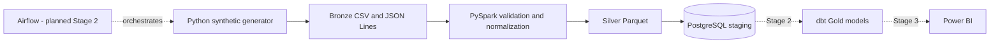

# Rental Analytics & Data Engineering Platform

A portfolio data-engineering project that turns reproducible rental source data into validated analytical datasets and PostgreSQL staging tables. The repository intentionally preserves the original third-semester SQL assignment while building a modern platform around it in three reviewed stages.

## Project status

**Stage 1 - foundation - is implemented.** It provides a working vertical slice:

```text
deterministic Python generator
        -> Bronze CSV / JSON Lines
        -> PySpark validation and normalization
        -> Silver Parquet
        -> PostgreSQL staging tables
```

Stage 2 (incremental Bronze/Silver/Gold processing, data-quality quarantine, dbt, and Airflow) and Stage 3 (Power BI artifacts, performance evidence, and final operational polish) are roadmap items. They are not claimed as current capabilities.

## Why this project exists

Rental businesses need consistent property, agreement, tenant, and payment data before they can answer questions about occupancy, revenue, overdue payments, or rental trends. Stage 1 establishes the reproducible ingestion boundary: deterministic sources, explicit validation, typed normalization, Parquet outputs, and relational staging tables.

The design keeps the default workload intentionally small so it can run on a student computer. PostgreSQL is the canonical runtime for the new platform; SQL Server and Oracle remain available as the educational history.

## Architecture



Stage 1 responsibilities are deliberately narrow:

- `generator.py` creates deterministic, internally consistent source records with stable IDs.
- `validation.py` applies shared type, value, date, uniqueness, and relationship rules.
- `spark_pipeline.py` reads Bronze data with Spark and writes typed Parquet datasets.
- `loader.py` replaces the six PostgreSQL staging tables in a single transaction.
- `pipeline.py` coordinates the thin end-to-end flow and emits structured JSON logs.

## Stage 1 data model

The default profile uses seed `42` and `12` properties. It produces:

| Entity | Default records | Key relationships |
|---|---:|---|
| Locations | 5 | Referenced by properties |
| Owners | 4 | Referenced by properties |
| Tenants | 12 | Referenced by rental agreements |
| Properties | 12 | Belong to a location and owner |
| Rental agreements | 12 | Connect a property and tenant |
| Payments | 36 | Three payments per agreement |

The generator writes locations, owners, tenants, properties, and agreements as CSV, and payments as JSON Lines. Generated files are local artifacts and are ignored by Git.

Validation currently fails the complete batch with an actionable non-zero error when it finds:

- a missing required identifier or field;
- a duplicate identifier;
- a non-positive property size;
- a negative property rent, agreement rent, or payment amount;
- a malformed date or an agreement ending before it starts;
- an unknown location, owner, tenant, property, or agreement reference.

Record-level quarantine is intentionally deferred to Stage 2.

## Quickstart with Docker

Requirements: Docker Engine/Desktop with Docker Compose. The pipeline image includes Python 3.12, Java 17, and PySpark 3.5.9, so no host Java installation is required.

1. Create local configuration. The committed values are development-only defaults:

   ```powershell
   Copy-Item .env.example .env
   ```

   On macOS or Linux, use `cp .env.example .env`.

2. Validate the Compose model and start PostgreSQL:

   ```powershell
   docker compose config --quiet
   docker compose up --detach --wait postgres
   ```

3. Build and run the complete Stage 1 pipeline:

   ```powershell
   docker compose --profile pipeline run --build --rm pipeline
   ```

4. Confirm the staging counts:

   ```powershell
   docker compose exec postgres psql -U rental -d rental_analytics -c "SELECT 'properties' AS entity, count(*) FROM staging.properties UNION ALL SELECT 'payments', count(*) FROM staging.payments;"
   ```

5. Stop services while preserving the named database volume:

   ```powershell
   docker compose down
   ```

`docker compose down --volumes` also removes the local PostgreSQL data and should be used only when a clean reset is intended. The versioned migration at `warehouse/migrations/001_create_staging.sql` is applied automatically when the volume is first created.

## Local Python workflow

Use Python 3.12. Java 17 is needed only for a host-side Spark run; the generator, validation, lint, and unit tests do not start Spark.

```powershell
py -3.12 -m venv .venv
.venv\Scripts\python -m pip install --upgrade pip
.venv\Scripts\python -m pip install --editable ".[dev]"
.venv\Scripts\rental-platform generate
.venv\Scripts\rental-platform validate
.venv\Scripts\ruff check .
.venv\Scripts\ruff format --check .
.venv\Scripts\pytest -m "not integration"
```

Useful commands:

```powershell
# Override the deterministic profile for one generation run
rental-platform generate --dataset-size 25 --seed 100

# Produce Bronze and Silver locally without PostgreSQL
rental-platform run --skip-load

# Run the complete flow against configured PostgreSQL
rental-platform run
```

All settings use the `RENTAL_` prefix and are documented in `.env.example`. Credentials are never logged. CLI failures return a non-zero exit code.

## Tests and CI

The unit suite covers configuration parsing, deterministic output bytes, source reading, normalization, core quality rules, relationships, duplicate IDs, and CLI exit behavior. The integration smoke test loads generated records into real PostgreSQL staging tables and verifies stored row counts.

Run the complete local verification after installing development dependencies:

```powershell
.\scripts\verify_stage1.ps1 -Python .venv\Scripts\python.exe
```

The GitHub Actions workflow installs Python 3.12 and Java 17, checks Ruff lint and formatting, compiles and builds the package, validates Docker Compose, initializes PostgreSQL, runs the real Spark pipeline, and executes pytest including the PostgreSQL smoke test.

## Repository structure

```text
.
|-- .github/workflows/quality.yml       # Stage 1 CI gates
|-- docker/pipeline.Dockerfile          # Python 3.12 + Java 17 pipeline runtime
|-- docs/                               # Original assignment and ER diagrams
|-- scripts/verify_stage1.ps1           # Reproducible local checks
|-- sql/oracle/                         # Preserved academic Oracle implementation
|-- sql/sql-server/                     # Preserved academic SQL Server implementation
|-- src/rental_platform/                # Typed generator, validation, Spark, and loader code
|-- tests/                              # Unit and PostgreSQL integration tests
|-- warehouse/migrations/               # Versioned PostgreSQL staging DDL
|-- compose.yaml
|-- pyproject.toml
`-- README.md
```

## Preserved academic project

The repository began as a third-semester relational database assignment written in Polish. It models people and their owner, tenant, and real-estate-agent roles; land or property spaces; houses; and rental agreements. Both implementations remain unchanged:

- `sql/sql-server/` - schema, sample data, 13 analytical queries, procedures, and triggers;
- `sql/oracle/` - the corresponding Oracle schema, sample data, queries, procedures, and triggers;
- `docs/diagrams/` - the original Vertabelo ER diagrams;
- `docs/requirements-pl.pdf` - the original assignment requirements.


These scripts are educational/legacy assets, not migrations for the new PostgreSQL platform.

To run the SQL Server version, select a dedicated development database in SQL Server Management Studio and execute `sql/sql-server/01-schema-seed-and-queries.sql`, followed optionally by `02-procedures-and-triggers.sql`. For Oracle, use an empty development schema in Oracle SQL Developer and execute the two scripts in the same order; enable DBMS Output for messages from the optional routines.

## Three-stage direction

| Stage | Scope | Status |
|---|---|---|
| 1 | Deterministic sources, validation, Silver Parquet, PostgreSQL staging, tests, CI | Implemented |
| 2 | Rejected records, batch audit, incremental/idempotent loads, dbt dimensional warehouse, Airflow | Planned |
| 3 | Power BI semantic model, measured indexing benchmark, expanded end-to-end verification | Planned |

## Current limitations

- Stage 1 is a full staging-table replacement, not an incremental load.
- Validation stops the batch; rejected-record quarantine and audit metadata are Stage 2 work.
- The small Stage 1 pipeline collects source records on the Spark driver before applying shared Python validation. Distributed quality rules are planned before larger profiles are introduced.
- dbt, Airflow, Gold dimensional models, analytical marts, and Power BI artifacts are not implemented yet.
- PostgreSQL credentials in `.env.example` are safe development defaults only and must be replaced outside local development.
- The original Oracle and SQL Server scripts are preserved but are not exercised by the new platform CI.
