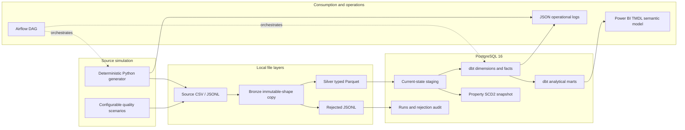
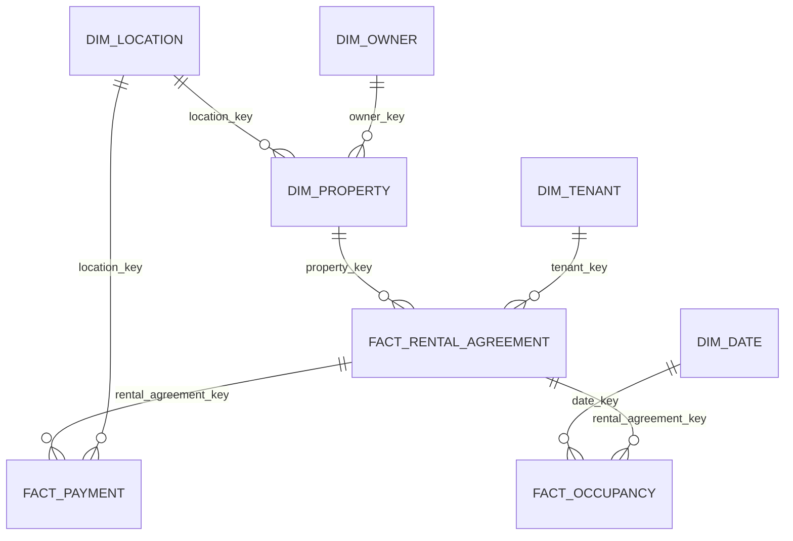

# Platform architecture

## System view

The design uses one tool per clear responsibility. Python owns deterministic source simulation, shared business rules, incremental loading, and operational commands. PySpark supplies typed Parquet transformation. PostgreSQL is the durable runtime. dbt owns warehouse SQL, documentation, testing, and history. Airflow schedules the existing commands; it does not duplicate pipeline logic. Power BI consumes only tested Gold facts/marts.

## Dimensional model

Facts deliberately retain commonly filtered dimension keys. The current property dimension supports current-state analysis; `analytics_snapshots.property_history` separately retains checked property changes as SCD Type 2 history.

## Security and deployment boundary

Compose defaults are explicitly local-development credentials. Secrets come from environment variables and are never stored in TMDL, generated evidence, logs, or Git. Airflow standalone and the single-host Spark runtime demonstrate the workflow but are not a production deployment topology.
