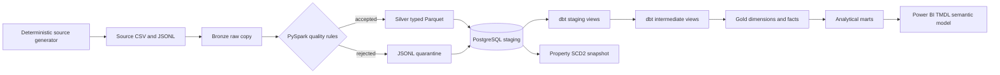

# Data lineage and layer responsibilities

- Source is a reproducible external-system simulation. A separate ingest step copies it without mutation to Bronze.
- Bronze preserves raw strings and is replayable. It is overwritten by the current local input profile; batch identity is carried into subsequent artifacts.
- Silver contains only normalized, typed accepted rows in Parquet. Quality summaries and rejected JSON Lines are partitioned by batch ID beside it.
- PostgreSQL staging stores the current accepted business state, rejection history, and run audit. Fingerprints decide insert, update, or skip.
- dbt staging views rename no business concepts; intermediate views resolve domain joins; Gold tables implement a star schema; marts expose business-ready aggregates.
- `property_history` snapshots changing property price and selected attributes independently of the current-state property dimension.
- The Power BI import model reads six explicit Gold/mart queries and adds DAX measures without embedding database credentials.

The Airflow DAG follows the executable chain `generate -> ingest -> validate -> transform -> load -> dbt_build -> publish_run_summary`. Each task calls the same CLI or dbt command documented for manual operation.
