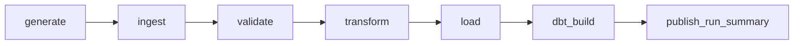

# Airflow orchestration

The manually triggered `rental_analytics_pipeline` DAG uses Airflow 2.11.2 and a stable, sanitized `run_id` as the batch ID:



All tasks are `BashOperator` calls to real project entry points. Generation currently also refreshes Bronze for backward-compatible Stage 1 CLI behavior, so the explicit ingest task repeats that copy safely and makes the architectural boundary visible. Validation produces early quality feedback; transformation repeats the same deterministic rules while writing typed Silver Parquet.

Only `load` has automatic retries: two retries with a one-minute delay cover short PostgreSQL connectivity interruptions, and fingerprint-based loading makes those retries idempotent. Deterministic local file tasks do not retry. A failed task blocks every downstream task. Load failures are recorded in `staging.pipeline_runs` when PostgreSQL is reachable; failures before load have no database audit row, but remain visible in Airflow task logs. dbt test failures prevent a successful summary task.

Start the optional service with:

```powershell
docker compose --profile airflow up --build --detach airflow
docker compose --profile airflow ps
```

Open `http://localhost:8080`, use the development credentials from `.env`, unpause the DAG, and trigger it. The standalone service is intended for local demonstration, not production: replace its credentials, secrets management, executor, logs, and metadata database topology for a deployed environment.
